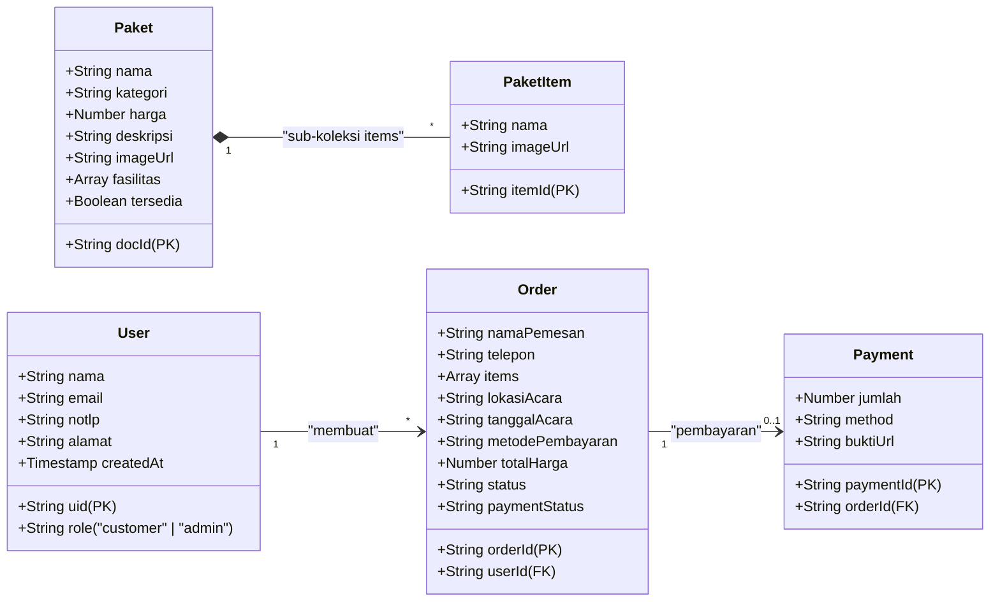

# 🍛 Nadya Catering Web Application

Aplikasi manajemen dan pemesanan jasa katering berbasis web (*Nadya Catering Pineleng*) yang dirancang khusus untuk memenuhi kebutuhan kuliner acara pernikahan, syukuran, dan ulang tahun di area Minahasa & Manado, Sulawesi Utara. Proyek ini dibangun menggunakan arsitektur *Hybrid Web* yang mengintegrasikan basis data cloud *real-time* dan penyimpanan file lokal berbasis PHP.

---

## 📌 Daftar Isi
1. [Fitur Utama](#-fitur-utama)
2. [Arsitektur & Konsep Hybrid](#️-arsitektur--konsep-hybrid)
3. [Stack Teknologi](#-stack-teknologi)
4. [UML & Pemodelan Sistem](#-uml--pemodelan-sistem)
   - [Use Case Diagram](#1-use-case-diagram)
   - [Class & ERD Diagram (Firestore NoSQL)](#2-class--erd-diagram-firestore-nosql)
   - [Flowchart Alur Pemesanan & Verifikasi](#3-flowchart-alur-pesanan--verifikasi)
5. [Akun Pengujian (Testing Credentials)](#-akun-pengujian-testing-credentials)
6. [Panduan Instalasi & Menjalankan di Lokal (XAMPP)](#-panduan-instalasi--menjalankan-di-lokal-xampp)
7. [Konfigurasi Firebase Multi-Device](#-konfigurasi-firebase-multi-device)
8. [Panduan Deployment ke Hostinger](#-panduan-deployment-ke-hostinger)

---

## 🚀 Fitur Utama

### 1. Sisi Pelanggan (Customer)
* **Katalog Paket Potret (9:16)**: Menampilkan pilihan paket katering dengan format sampul penuh vertikal dan rincian sub-hidangan dinamis.
* **Autentikasi Aman**: Sistem Masuk & Daftar akun yang diamankan oleh Firebase Authentication.
* **Keranjang Belanja Pintar**: Pengaturan kuantitas porsi dinamis dengan proteksi wajib login sebelum menambahkan barang atau mengakses keranjang (`cart.html`).
* **Form Informasi Acara**: Pengisian nama acara, waktu, **lokasi/alamat pengantaran gedung**, metode pembayaran, dan catatan khusus.
* **Konfirmasi & Pembayaran (`order-success.html`)**: Halaman rincian tagihan lengkap dengan opsi salin nomor rekening (BCA, Mandiri, BRI, DANA), tombol kirim pesan otomatis ke WhatsApp, serta fitur *upload* bukti transfer langsung.
* **Riwayat Pesanan Saya (`riwayat-pesanan.html`)**: Dasbor pelacakan status transaksi (*Pending*, *Diproses*, *Selesai*) yang disaring murni berdasarkan `userId` akun yang aktif.

### 2. Sisi Administrator (Admin Dashboard)
* **Dashboard Metrik (`admin.html`)**: Pemantauan statistik total paket aktif, pesanan masuk, dan ringkasan transaksi.
* **Kelola Pesanan (`admin-pesanan.html`)**: Validasi bukti transfer, pembaruan status pembayaran (*Unpaid* ➔ *Menunggu Verifikasi* ➔ *Lunas*), dan pengubahan status pengerjaan katering.
* **Kelola Menu Paket (`admin-menu.html`)**: Antarmuka berbasis Tailwind untuk menambah/menghapus paket dan sub-hidangan makanan dengan jalur gambar otomatis (`images/{Nama Paket}/{Nama Makanan}.jpg`).
* **Kelola Pelanggan (`admin-pelanggan.html`)**: Tinjauan daftar seluruh pengguna terdaftar beserta peran aksesnya.

---

## ⚙️ Arsitektur & Konsep Hybrid

Aplikasi ini menerapkan pola **Hybrid Architecture**:
1. **Cloud Realtime Database & Auth**: Seluruh data pengguna, katalog paket, sub-koleksi item, dan dokumen pesanan dikelola di **Google Cloud Firestore** dan **Firebase Auth**.
2. **Local Server Media Storage**: Mengingat Firebase Storage memerlukan paket berbayar (*Blaze plan*), unggahan foto menu admin dan bukti pembayaran pelanggan dikirim melalui endpoint **PHP (`php/upload_bukti.php`)** untuk disimpan secara langsung ke direktori server lokal (`uploads/payment/`). Path URL relatifnya kemudian direkam ke dokumen Firestore.

---

## 🛠️ Stack Teknologi
* **Frontend Framework**: Bootstrap 3 (Client pages) & Tailwind CSS v3 via CDN (Admin dashboard).
* **Ikon & Tipografi**: Font Awesome & Google Fonts (*Plus Jakarta Sans*).
* **Backend & Database**: Firebase Auth, Cloud Firestore (NoSQL v8 SDK).
* **Server Processing**: PHP 7.4+ / 8.x (untuk fungsi penanganan `move_uploaded_file`).
* **Deployment Target**: Hostinger (Apache / LiteSpeed Web Server).

---

## 📊 UML & Pemodelan Sistem

### 1. Use Case Diagram
```mermaid
usecaseDiagram
    actor Tamu as "Pengunjung / Tamu"
    actor Pelanggan as "Pelanggan (Customer)"
    actor Admin as "Administrator"

    rectangle "Sistem Web Nadya Catering" {
        usecase UC1 as "Melihat Beranda & Katalog Paket"
        usecase UC2 as "Melihat Detail & Menu Makanan"
        usecase UC3 as "Mendaftar Akun Baru (Register)"
        usecase UC4 as "Masuk ke Akun (Login)"
        usecase UC5 as "Mengelola Profil Pengguna"
        usecase UC6 as "Menambah Paket ke Keranjang"
        usecase UC7 as "Checkout & Mengisi Lokasi Acara"
        usecase UC8 as "Membuat Pesanan & Konfirmasi WhatsApp"
        usecase UC9 as "Mengunggah Bukti Pembayaran"
        usecase UC10 as "Melihat Riwayat Pesanan Saya"
        
        usecase UC11 as "Mengelola Dashboard Statistik"
        usecase UC12 as "Mengelola Data & Kategori Paket"
        usecase UC13 as "Mengelola Menu Sub-Koleksi Items"
        usecase UC14 as "Memverifikasi Pesanan & Pembayaran"
        usecase UC15 as "Mengelola Data Pelanggan"
    }

    Tamu --> UC1
    Tamu --> UC2
    Tamu --> UC3
    Tamu --> UC4

    Pelanggan --> UC1
    Pelanggan --> UC2
    Pelanggan --> UC4
    Pelanggan --> UC5
    Pelanggan --> UC6
    Pelanggan --> UC7
    Pelanggan --> UC8
    Pelanggan --> UC9
    Pelanggan --> UC10

    Admin --> UC11
    Admin --> UC12
    Admin --> UC13
    Admin --> UC14
    Admin --> UC15

    UC6 .> UC4 : "include"
    UC7 .> UC4 : "include"
    UC10 .> UC4 : "include"
```

### 2. Class & ERD Diagram (Firestore NoSQL)


### 3. Flowchart Alur Pesanan & Verifikasi


---

## 🔑 Akun Pengujian (Testing Credentials)

Gunakan akun administrator berikut untuk menguji fitur pengelolaan pesanan dan manajemen menu di halaman admin:

| Peran (Role) | Email | Password | Hak Akses |
| :--- | :--- | :--- | :--- |
| **Administrator** | `arron@gmail.com` | `123456` | Akses penuh seluruh panel `/admin*.html` |
| **Pelanggan** | *Daftar sendiri via modal* | *Bebas (Min. 6 karakter)* | Akses katalog, keranjang, & riwayat pesanan |

---

## 💻 Panduan Instalasi & Menjalankan di Lokal (XAMPP)

Jika rekan tim Anda ingin mengunduh dan menjalankan proyek ini di komputer lokal:

1. **Prasyarat**:
   * Terpasang **XAMPP** (Modul Apache & PHP aktif).
   * Koneksi internet aktif (karena Firestore & Firebase Auth berjalan secara cloud).
2. **Langkah Pemasangan**:
   * Kloning repositori atau ekstrak arsip ZIP ke dalam direktori server lokal Anda:
     ```text
     C:\xampp\htdocs\Aaron\
     ```
   * Buka **XAMPP Control Panel**, lalu klik **Start** pada modul **Apache**.
   * Pastikan direktori penampung upload tersedia:
     ```text
     C:\xampp\htdocs\Aaron\uploads\payment\
     ```
   * Buka browser dan akses aplikasi melalui URL:
     ```text
     http://localhost/Aaron/index.html
     ```

---

## 🌐 Konfigurasi Firebase Agar Bisa Diakses Semua Device

Karena basis data berbasis cloud, perangkat lain dapat terhubung ke database yang sama asalkan pengaturan berikut dikonfigurasi di [Firebase Console](https://console.firebase.google.com/):

1. **Authorized Domains (Wajib)**:
   * Masuk ke **Firebase Console** ➔ **Authentication** ➔ **Settings** ➔ **Authorized domains**.
   * Tambahkan domain lokal dan produksi Anda:
     * `localhost`
     * `127.0.0.1`
     * Domain hosting Anda (misal: `nadyacatering.com`)
2. **Cloud Firestore Rules**:
   * Masuk ke menu **Firestore Database** ➔ Tab **Rules**, pastikan aturan izin akses diset sebagai berikut:
     ```javascript
     rules_version = '2';
     service cloud.firestore {
       match /databases/{database}/documents {
         match /users/{userId} {
           allow read, write: if request.auth != null;
         }
         match /paket/{document=**} {
           allow read: if true;
           allow write: if request.auth != null;
         }
         match /orders/{orderId} {
           allow read, write: if request.auth != null;
         }
         match /payments/{paymentId} {
           allow read, write: if request.auth != null;
         }
         match /{document=**} {
           allow read: if true;
         }
       }
     }
     ```

---

## 🚀 Panduan Deployment ke Hostinger

1. Kompres seluruh isi folder proyek menjadi satu file arsip berformat `.zip` (pastikan file utama seperti `index.html` berada tepat di dalam root direktori arsip).
2. Masuk ke **hPanel Hostinger** ➔ **File Manager** ➔ Buka direktori **`public_html`**.
3. Unggah file `.zip` tersebut dan pilih menu **Extract**.
4. Atur izin akses (*Permissions*) pada direktori `uploads` dan `uploads/payment` menjadi **`755`** agar skrip PHP diizinkan membuat dan menulis berkas gambar baru dari peramban.
5. Daftarkan domain publik Hostinger Anda ke daftar **Authorized Domains** di Firebase Console. Website siap digunakan secara online!
