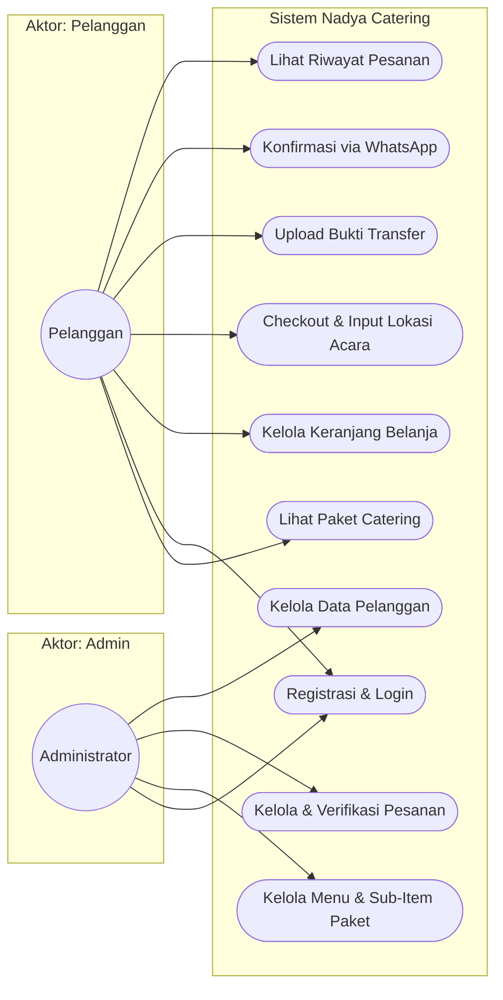
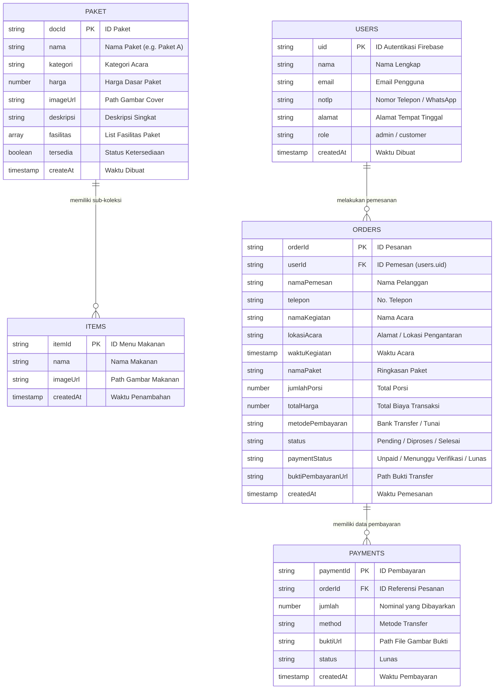
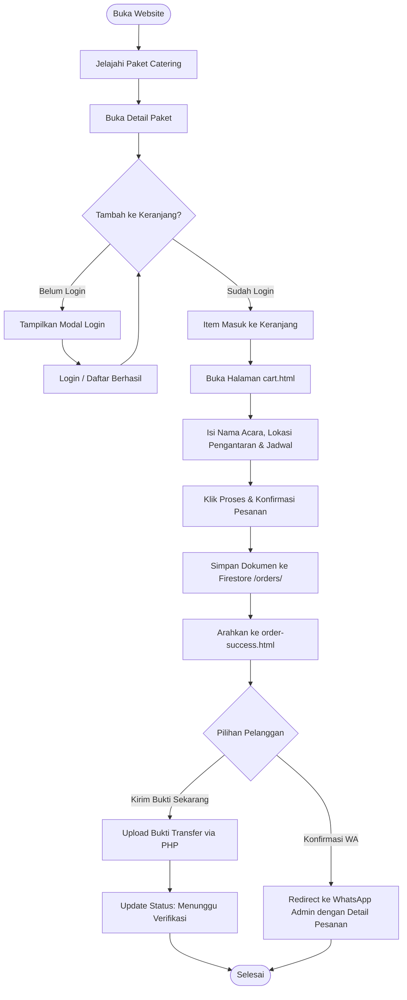
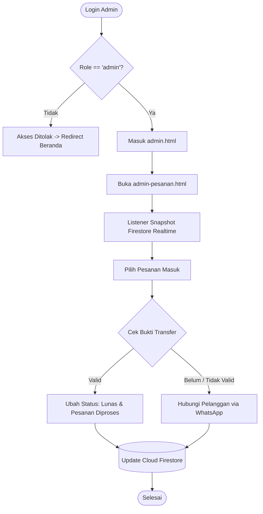

# Nadya Catering Pineleng - Web Application

Aplikasi web manajemen pemesanan katering berbasis arsitektur *Hybrid Web* yang mengintegrasikan antarmuka modern (Bootstrap & Tailwind CSS), backend basis data *real-time* berbasis cloud (**Google Firebase Authentication & Cloud Firestore**), serta upload berkas lokal berbasis **PHP** untuk penyimpanan bukti transaksi dan gambar menu.

---

## 📌 Daftar Isi
1. [Fitur Utama](#-fitur-utama)
2. [Arsitektur & Konsep Hybrid](#-arsitektur--konsep-hybrid)
3. [Akun Pengujian (Testing Credentials)](#-akun-pengujian-testing-credentials)
4. [Diagram Sistem (UML & Flowchart)](#-diagram-sistem-uml--flowchart)
   - [Use Case Diagram](#1-use-case-diagram)
   - [Entity Relationship Diagram (Firestore Data Model)](#2-entity-relationship-diagram-firestore-data-model)
   - [Flowchart Pemesanan Pelanggan](#3-flowchart-pemesanan-pelanggan)
   - [Flowchart Verifikasi Admin](#4-flowchart-verifikasi-admin)
5. [Panduan Instalasi & Menjalankan di Lokal (XAMPP)](#-panduan-instalasi--menjalankan-di-lokal-xampp)
6. [Konfigurasi Firebase Agar Bisa Diakses Semua Device](#-konfigurasi-firebase-agar-bisa-diakses-semua-device)
7. [Panduan Deployment ke Hostinger](#-panduan-deployment-ke-hostinger)

---

## 🚀 Fitur Utama

### Sisi Pelanggan (Client-Side)
- **Katalog Menu Interaktif**: Menampilkan daftar paket katering dengan format cover potret (rasio 9:16) dan rincian sub-hidangan langsung dari Cloud Firestore.
- **Autentikasi Aman**: Login dan registrasi terintegrasi dengan Firebase Auth.
- **Keranjang Belanja (Cart)**: Pengaturan kuantitas porsi dinamis dengan integrasi form alamat/lokasi acara serta tanggal kegiatan.
- **Konfirmasi Transaksi Dinamis (`order-success.html`)**: Halaman instruksi transfer bank (BCA, Mandiri, BRI, DANA) dengan opsi *copy-to-clipboard*, tautan pesan otomatis WhatsApp, dan upload bukti transfer.
- **Riwayat Pesanan (`riwayat-pesanan.html`)**: Melacak histori pesanan spesifik milik akun yang sedang masuk (difilter berdasarkan `userId`).

### Sisi Pengelola (Admin Dashboard)
- **Dashboard Statistik**: Metrik pendapatan, jumlah pesanan aktif, total pelanggan, dan grafik ringkasan pesanan.
- **Kelola Pesanan (`admin-pesanan.html`)**: Pembaruan status pesanan (*Pending*, *Diproses*, *Selesai*, *Dibatalkan*), verifikasi pembayaran, dan pengecekan lokasi acara.
- **Kelola Menu Paket (`admin-menu.html`)**: Penambahan dan pengeditan paket utama beserta sub-koleksi hidangan makanan dengan pembuatan jalur gambar otomatis.
- **Kelola Pelanggan (`admin-pelanggan.html`)**: Tinjauan daftar pengguna terdaftar beserta peran (*role*).

---

## ⚙️ Arsitektur & Konsep Hybrid

Aplikasi ini menggunakan pendekatan **Hybrid**:
1. **Data & State Management**: Menggunakan **Firebase Auth** (autentikasi pengguna) dan **Cloud Firestore** (NoSQL Realtime Database).
2. **Media Storage**: Karena Firebase Storage memerlukan paket berbayar (Blaze) untuk skala tertentu, file gambar dan bukti transaksi disimpan langsung ke direktori server hosting/lokal (`uploads/payment/`) melalui skrip perantara `php/upload_bukti.php`. Path URL gambar kemudian disimpan ke dokumen Firestore.

---

## 🔑 Akun Pengujian (Testing Credentials)

Gunakan akun administrator berikut untuk menguji fitur dashboard admin:

| Peran (Role) | Email | Password | Hak Akses |
| :--- | :--- | :--- | :--- |
| **Administrator** | `arron@gmail.com` | `123456` | Akses penuh dashboard admin (`admin.html`) |
| **Pelanggan** | *Daftar mandiri di web* | *Bebas (min. 6 karakter)* | Pemesanan menu & riwayat transaksi |

> **Catatan:** Dokumen pengguna untuk `arron@gmail.com` di koleksi `users` pada Firestore harus memiliki field `role: "admin"`.

---

## 📊 Diagram Sistem (UML & Flowchart)

### 1. Use Case Diagram



---

### 2. Entity Relationship Diagram (Firestore Data Model)



---

### 3. Flowchart Pemesanan Pelanggan



---

### 4. Flowchart Verifikasi Admin



---

## 💻 Panduan Instalasi & Menjalankan di Lokal (XAMPP)

Jika rekan tim Anda mendownload repository ini untuk dijalankan di komputer lokal:

### 1. Prasyarat
- **XAMPP** (sudah terpasang Apache & PHP versi 7.4 / 8.x).
- Koneksi Internet aktif (karena Firebase SDK dan basis data menggunakan Cloud Firestore).

### 2. Langkah Pemasangan
1. Salin atau clone repository ke dalam folder `htdocs` XAMPP:
   ```bash
   cd C:\xampp\htdocs
   git clone https://github.com/adriannicholasl/nadyacatering.git Aaron
   ```
   *(Atau ekstrak file zip ke dalam folder `C:\xampp\htdocs\Aaron\`)*.

2. Buka **XAMPP Control Panel**, lalu klik **Start** pada modul **Apache**.

3. Pastikan folder upload bukti pembayaran ada:
   - Periksa apakah folder `C:\xampp\htdocs\Aaron\uploads\payment\` sudah tersedia. Jika belum, buat folder tersebut secara manual.

4. Buka peramban (browser) dan akses:
   ```text
   http://localhost/Aaron/index.html
   ```

---

## 🌐 Konfigurasi Firebase Agar Bisa Diakses Semua Device

Karena basis data Cloud Firestore berbasis cloud, **semua komputer/HP yang menjalankan aplikasi ini akan otomatis terhubung ke database yang sama** asalkan pengaturan berikut diterapkan di [Firebase Console](https://console.firebase.google.com/):

### 1. Pengaturan Authorized Domains (Wajib)
Firebase Auth memblokir upaya login dari domain yang tidak dikenal. Agar teman Anda bisa login baik dari localhost maupun domain lain:
1. Buka **Firebase Console** -> Proyek Anda.
2. Masuk ke menu **Build** -> **Authentication** -> Tab **Settings**.
3. Gulir ke bagian **Authorized domains**.
4. Pastikan entri berikut terdaftar:
   - `localhost`
   - `127.0.0.1`
   - Domain hosting Anda (misal: `nadyacatering.com` atau domain Hostinger).

### 2. Aturan Keamanan Firestore (Security Rules)
Buka menu **Firestore Database** -> Tab **Rules**, lalu pastikan aturan berikut sudah dipublikasikan (*Publish*) agar sub-koleksi paket dan pesanan tidak diblokir izin aksesnya:

```javascript
rules_version = '2';
service cloud.firestore {
  match /databases/{database}/documents {

    // KOLEKSI USERS
    match /users/{userId} {
      allow read, write: if request.auth != null;
    }

    // KOLEKSI PAKET & SUB-KOLEKSI ITEMS
    match /paket/{document=**} {
      allow read: if true;
      allow write: if request.auth != null;
    }

    // KOLEKSI ORDERS
    match /orders/{orderId} {
      allow read, write: if request.auth != null;
    }

    // KOLEKSI PAYMENTS
    match /payments/{paymentId} {
      allow read, write: if request.auth != null;
    }

    // FALLBACK READ
    match /{document=**} {
      allow read: if true;
    }
  }
}
```

---

## 🚀 Panduan Deployment ke Hostinger

1. Kompres semua file di direktori kerja menjadi file `.zip` (pastikan file `index.html` berada di root zip).
2. Masuk ke **hPanel Hostinger** -> **File Manager** -> buka direktori **`public_html`**.
3. Unggah file zip dan ekstrak langsung di dalam `public_html`.
4. Atur hak akses (*Permissions*) pada folder `uploads` dan `uploads/payment` menjadi **`755`** atau **`775`** agar script PHP diizinkan menulis file bukti pembayaran.
5. Daftarkan nama domain Hostinger Anda ke menu **Authorized Domains** di Firebase Console.