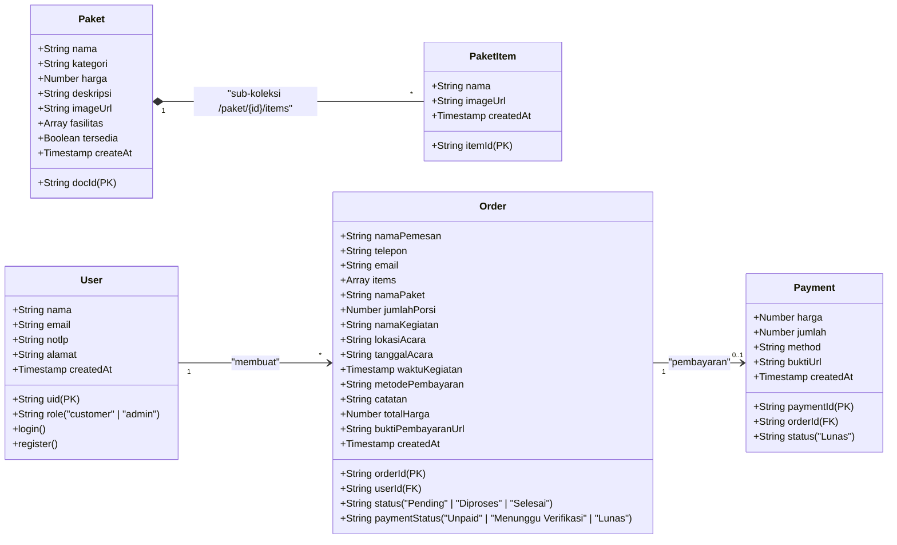
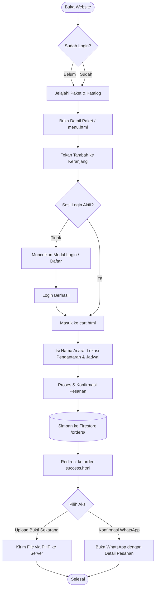
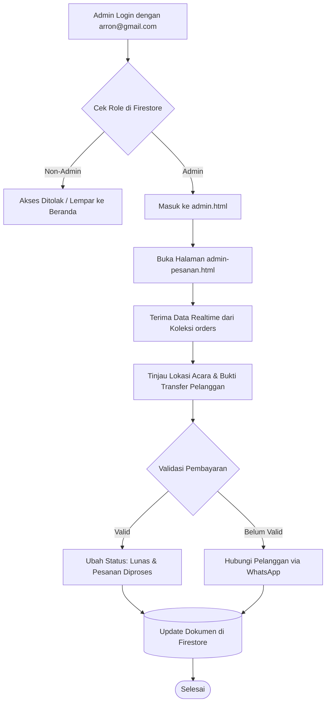

# Nadya Catering Pineleng - Web Application

[]()
[]()
[]()

Aplikasi web manajemen pemesanan katering profesional berbasis arsitektur *Hybrid Web* yang dikembangkan untuk **Nadya Catering Pineleng** (Minahasa & Manado, Sulawesi Utara). Platform ini mengintegrasikan antarmuka responsif modern, basis data *real-time* cloud, serta penyimpanan berkas lokal via PHP untuk efisiensi media tanpa ketergantungan pada penyimpanan cloud berbayar.

---

## 📌 Daftar Isi

1. [Fitur Utama](#-fitur-utama)
2. [Arsitektur & Konsep Hybrid](#️-arsitektur--konsep-hybrid)
3. [Teknologi yang Digunakan](#-teknologi-yang-digunakan)
4. [Akun Pengujian (Testing Credentials)](#-akun-pengujian-testing-credentials)
5. [UML Class & Entity Relationship Diagram (ERD)](#-uml-class--entity-relationship-diagram-erd)
6. [Alur Diagram Sistem (Flowcharts)](#-alur-diagram-sistem-flowcharts)
7. [Panduan Instalasi & Menjalankan di Lokal (XAMPP)](#-panduan-instalasi--menjalankan-di-lokal-xampp)
8. [Konfigurasi Firebase Multi-Device](#-konfigurasi-firebase-multi-device)
9. [Panduan Deployment ke Hostinger](#-panduan-deployment-ke-hostinger)

---

## 🚀 Fitur Utama

### 👤 Sisi Pelanggan (Client-Side)
* **Katalog Paket Potret (9:16)**: Menampilkan pilihan paket katering dengan format sampul penuh vertikal dan rincian sub-hidangan dinamis dari sub-koleksi database.
* **Autentikasi Terintegrasi**: Sistem Masuk & Daftar akun yang diamankan oleh Firebase Authentication.
* **Keranjang Belanja Pintar**: Pengaturan kuantitas porsi dinamis dengan proteksi wajib login sebelum menambahkan barang atau mengakses keranjang.
* **Informasi & Lokasi Acara**: Form checkout yang mewajibkan input nama acara, alamat/lokasi pengantaran gedung, jadwal, dan catatan khusus.
* **Konfirmasi & Pembayaran (`order-success.html`)**: Halaman rincian tagihan lengkap dengan opsi salin nomor rekening (BCA, Mandiri, BRI, DANA), tombol kirim pesan otomatis ke WhatsApp, serta fitur *upload* bukti transfer langsung.
* **Riwayat Pesanan Saya (`riwayat-pesanan.html`)**: Dasbor pelacakan status transaksi (*Pending*, *Diproses*, *Selesai*) yang disaring murni berdasarkan `userId` akun yang aktif.

### 🛡️ Sisi Pengelola (Admin Dashboard)
* **Dashboard Metrik (`admin.html`)**: Pemantauan statistik total paket aktif, pesanan masuk, dan ringkasan transaksi.
* **Kelola Pesanan (`admin-pesanan.html`)**: Validasi bukti transfer, pembaruan status pembayaran (*Unpaid* ➔ *Menunggu Verifikasi* ➔ *Lunas*), dan pengubahan status pengerjaan katering.
* **Kelola Menu Paket (`admin-menu.html`)**: Antarmuka berbasis Tailwind untuk menambah/menghapus paket dan sub-hidangan makanan dengan jalur gambar otomatis (`images/{Nama Paket}/{Nama Makanan}.jpg`).
* **Kelola Pelanggan (`admin-pelanggan.html`)**: Tinjauan daftar seluruh pengguna terdaftar beserta peran aksesnya.

---

## ⚙️ Arsitektur & Konsep Hybrid

Aplikasi ini menerapkan pola **Hybrid Architecture**:
1. **Cloud Realtime Database & Auth**: Seluruh data pengguna, katalog paket, sub-koleksi item, dan dokumen pesanan dikelola di **Google Cloud Firestore** dan **Firebase Auth**.
2. **Local Server Media Storage**: Mengingat Firebase Storage memerlukan paket berbayar (*Blaze plan*), unggahan foto menu admin dan bukti pembayaran pelanggan dikirim melalui endpoint **PHP (`php/upload_bukti.php`)** untuk disimpan secara langsung ke direktori server lokal (`uploads/payment/`). Path URL relatifnya kemudian direkam ke dokumen Firestore.

---

## 🛠️ Teknologi yang Digunakan

* **Frontend Framework**: Bootstrap 3 (Client pages) & Tailwind CSS v3 via CDN (Admin dashboard).
* **Ikon & Tipografi**: Font Awesome & Google Fonts (*Plus Jakarta Sans*).
* **Backend & Database**: Firebase Auth, Cloud Firestore (NoSQL v8 SDK).
* **Server Processing**: PHP 7.4+ / 8.x (untuk fungsi penanganan `move_uploaded_file`).
* **Deployment Target**: Hostinger (Apache / LiteSpeed Web Server).

---

## 🔑 Akun Pengujian (Testing Credentials)

Gunakan akun administrator berikut untuk menguji fitur pengelohan pesanan dan manajemen menu di halaman admin:

| Peran (Role) | Email | Password | Hak Akses |
| :--- | :--- | :--- | :--- |
| **Administrator** | `arron@gmail.com` | `123456` | Akses penuh seluruh panel `/admin*.html` |
| **Pelanggan** | *Daftar sendiri via modal* | *Bebas (Min. 6 karakter)* | Akses katalog, keranjang, & riwayat pesanan |

> *Catatan: Pastikan pada dokumen Firestore koleksi `users` untuk UID akun `arron@gmail.com` memiliki field tambahan `role: "admin"`.*

---

## 📊 UML Class & Entity Relationship Diagram (ERD)

Berikut adalah pemodelan kelas dan struktur relasi data basis data NoSQL bersarang pada sistem:



---

## 🔀 Alur Diagram Sistem (Flowcharts)

### 1. Alur Pemesanan Pelanggan (Customer Checkout Flow)


### 2. Alur Verifikasi Admin (Admin Dashboard Flow)


---

## 💻 Panduan Instalasi & Menjalankan di Lokal (XAMPP)

Jika rekan tim Anda ingin mengunduh dan menjalankan proyek ini di komputer lokal:

1. **Prasyarat**:
   * Terpasang **XAMPP** (Modul Apache & PHP aktif).
   * Koneksi internet aktif (karena Firestore & Firebase Auth berjalan secara cloud).

2. **Langkah Pemasangan**:
   * Kloning repositori atau ekstrak arsip ZIP ke dalam direktori server lokal Anda:
     ```bash
     C:\xampp\htdocs\Aaron\
     ```
   * Buka **XAMPP Control Panel**, lalu klik **Start** pada modul **Apache**.
   * Pastikan struktur direktori folder penampung upload tersedia:
     ```text
     C:\xampp\htdocs\Aaron\uploads\payment\
     ```
   * Buka browser dan akses aplikasi melalui URL:
     ```text
     http://localhost/Aaron/index.html
     ```

---

## 🌐 Konfigurasi Firebase Agar Bisa Diakses Semua Device

Karena basis data berbasis cloud, perangkat lain (seperti HP atau laptop teman Anda) dapat terhubung ke database yang sama asalkan pengaturan berikut dikonfigurasi di [Firebase Console](https://console.firebase.google.com/):

1. **Authorized Domains (Wajib)**:
   * Masuk ke **Firebase Console** ➔ **Authentication** ➔ **Settings** ➔ **Authorized domains**.
   * Tambahkan domain lokal dan produksi Anda:
     * `localhost`
     * `127.0.0.1`
     * Domain hosting Anda (misal: `nadyacatering.com`)

2. **Cloud Firestore Rules**:
   * Masuk ke menu **Firestore Database** ➔ Tab **Rules**, pastikan aturan izin akses diset sebagai berikut:
     ```javascript
     rules_version = '2';
     service cloud.firestore {
       match /databases/{database}/documents {
         match /users/{userId} {
           allow read, write: if request.auth != null;
         }
         match /paket/{document=**} {
           allow read: if true;
           allow write: if request.auth != null;
         }
         match /orders/{orderId} {
           allow read, write: if request.auth != null;
         }
         match /payments/{paymentId} {
           allow read, write: if request.auth != null;
         }
         match /{document=**} {
           allow read: if true;
         }
       }
     }
     ```

---

## 🚀 Panduan Deployment ke Hostinger

1. Kompres seluruh isi folder proyek menjadi satu file arsip berformat `.zip` (pastikan file utama seperti `index.html` berada tepat di dalam root direktori arsip).
2. Masuk ke **hPanel Hostinger** ➔ **File Manager** ➔ Buka direktori **`public_html`**.
3. Unggah file `.zip` tersebut dan pilih menu **Extract**.
4. Atur izin akses (*Permissions*) pada direktori `uploads` dan `uploads/payment` menjadi **`755`** agar skrip PHP diizinkan membuat dan menulis berkas gambar baru dari peramban.
5. Daftarkan domain publik Hostinger Anda ke daftar **Authorized Domains** di Firebase Console. Website siap digunakan secara online!
